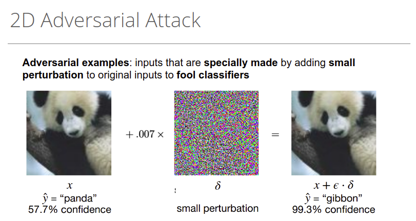
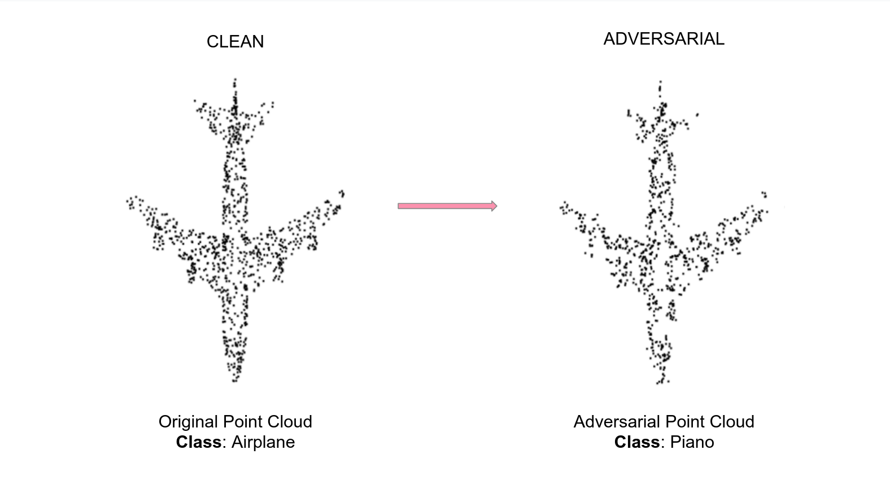
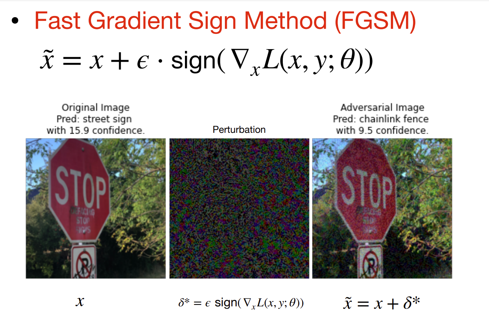
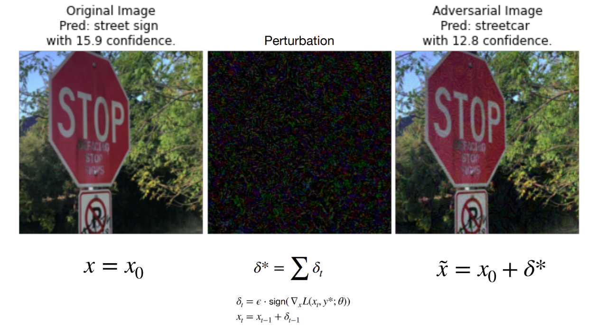
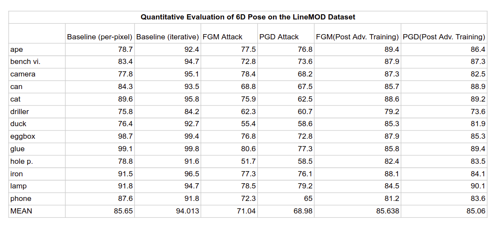
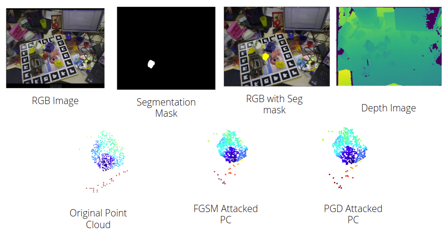
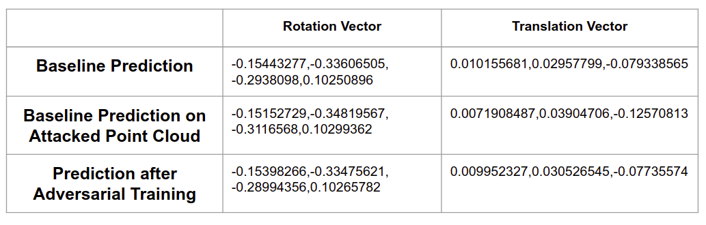

# Adversarial Attack Resilient 6D Pose Estimation using Dense Fusion 

## Objectives

- Implement dense fusion based 6D Pose estimation network
- Perform Adversarial attacks on the network to explore how the network can be fooled
	- Adversarial Attacks performed: FGM and PGD based attacks
- Perform adversarial training of the network to improve the robustness of the network to adversarial examples

## 6D Pose Estimation: 

- 6D Pose estimation corrsponds to obtaining the complete pose of an object characterized by the translation and the rotation transformation values w.r.to a world coordinate frame.
- In our work we follow an Iterative Dense Fusion based Deep Learning technique as proposed in the paper "DenseFusion: 6D Object Pose Estimation by Iterative Dense Fusion"([arXiv](https://arxiv.org/abs/1901.04780)) to realize the task.

## Network Architecture

The first stage takes color image as input and performs semantic segmentation for each known object category. Then, for each segmented object, we feed the masked depth pixels (converted to 3D point cloud) as well as an image patch cropped by the bounding box of the mask to the second stage. The second stage processes the results of the segmenta- tion and estimates the object’s 6D pose. 
It comprises four components: 
- 	a) a fully convolutional network that processes the color information and maps each pixel in the image crop to a color feature embedding
- 	b) a PointNet-based network that processes each point in the masked 3D point cloud to a geometric feature embedding
- 	c) a pixel-wise fusion network that combines both embeddings and outputs the estimation of the 6D pose of the object based on an unsupervised confidence scoring

- 

An iterative self-refinement methodology to train the network in a curriculum learning manner and refine the estimation result iteratively

## Loss Function

We define the pose estimation loss as the distance between the points sam- pled on the objects model in ground truth pose and corresponding points on the same model transformed by the predicted pose. Specifically, the loss to minimize for the prediction per dense-pixel is defined as

where xj denotes the jth point of the M randomly selected 3D points from the object’s 3D model, p = [R|t] is the ground truth pose, and pˆ = [Rˆ |tˆ] is the predicted pose generated from the fused embedding of the ith dense-pixel.

## Evaluation Metric
-The average closest point distance (ADD-S) is an ambiguity-invariant pose error metric which takes care of both symmetric and non-symmetric objects into an over-all evaluation. Given the estimated pose [R|t] and ground truth pose [R|t], ADD-S calculates the mean distance from each 3D model point transformed by [R|t] to its closest neighbour on the target model transformed by [R|t].

## Adversarial Attacks

### Definition
**Adversarial attacks:** An adversarial attack creates an example that compromises a victim network’s behavior at the
attacker’s will. Crafting an adversarial example is typically cast as an optimization problem, with an adversarial loss on the network’s output, along with a regularization term on the distortion of the input. Adversarial attacks have been thoroughly studied for 2D image classifiers and lately have been expanded to 3D
point clouds. Adversarial attacks on 3D point clouds can be of the type such as: shifting certain points on the point cloud by a small distance, add new points at random locations, removing some points. Several works have shown that this is an efficient strategy to misclassify an element even though the changes in the point cloud are very minute and imperceptible to the human eye. The following shows an example of adversarial attacks on both 2D and 3D data:

	

	

### Types of Adversarial Attacks: 

Adversarial attacks come in many forms. For 2D images, they can be as simple as applying random noise to putting additional image patches on the original images. In case of 3D point clouds, the space and scope of performing adversarial attacks is even extended as now we can increase the dimension of the data unlike the 2D images. As explained above, there are several ways in which we can perform 3D adversarial attacks. However, adversarial attacks in the context of 6D pose estimation is a relatively less studied concept. To the best of our knowledge there is no work that performs adversarial attacks on point cloud data. Our intention was to explore how such attacks can be replicated for the problem of 6D pose estimation. We hence perform 2 kind of attacks for this task of 6D pose estimation, namely FSGM attack and PGD attack. The following are a brief description of the attacks:

**FGSM Attack:** FGSM Attack stands for Fast Gradient Sign Method. The fast gradient sign method works by using the gradients of the neural network to create an adversarial example. For an input image, the method uses the gradients of the loss with respect to the input image to create a new image that maximises the loss. This new image is called the adversarial image. An illustration is given in the below image:

	

However, since we are dealing with point cloud information, the adversarial point cloud is obtained by taking the original point cloud, obtaining the loss value and then obtaining the gradient of the loss w.r.to the point cloud data to perform the adversarial attack. Please refer to the `attacks/FGM/fgm.py` for more details. 

**PGD Attack:** PGD Attack refers to Projected Gradient Descent. PGD based attack is an extension to the FGSM based attack, in that the FGSM attack is called iteratively to obtain the adversarial point cloud. The following is a demonstration of the PGD based attack for a 2D image. In this, a white-box based targetted attack has been performed on the image. In that, a perturbation is performed so that a stop sign can be misclassified as a street car. In our project, we implemented an untargetted PGD based attack to obtain the adversarial point cloud. 

	

## Attack Implementation: 

We perform the above suggested methods to perform adversarial attacks on the Dense Fusion network on LineMod data. The attacks have been very successful in that we were able to successfully fool the network to predict wrong 6D pose information. We use the baseline implementation of the network as described in the paper to train the model and then perform the attacks by freezing the weights of the model. We discuss the effectiveness of the method in the results section. 

## Adversarial Training: 

Now that we have two methods to successfully attack a network for the task of 6D Pose estimation, the next step is to successfully defend the network against such attacks. For the task of adversarial attacks on point cloud based 3D classification networks, several defense mechanisms have been suggested. One of the famous defense method is Adversarial Training. The basic idea is to simply create and then incorporate adversarial examples into the training process. In other words, since we know that “standard” training creates networks that are succeptible to adversarial examples, let’s just also train on a few adversarial examples. In our project, we perform the adversarial training, by first obtaining a normal point cloud from the data loader, then we obtain the adversarial example by using FGSM attacks and then we backpropogate the loss of the prediction of the model on both the original point cloud and the attacked point cloud. In this way, we perform an online version of the adversarial training of the network. 

# Results and Discussion

## Quantitative Results

We present a quantitative analysis of the effectiveness of our attack and defence mechanisms in the following table. We present the baseline results on the ADD Metric that we obtain using the hyper parameters as suggested in the paper. We present the results with both pose refinement step and without pose refinement. Then we show how the model performs under the FGSM and PGD attacks. Ultimately, we show the robustness of the Adversarial Training defense mechanism by comparing the performance with and without adversarial training. We performed all the experiments on the LineMOD data. Our initial plan was to implement the system for both YCB Dataset and the LineMOD dataset. However, we later realized the computational expenses in performing the adversarial training on the YCB Dataset and decided not to pursue it. 

	
	

As expected, upon both FGSM and the PGD attacks, we can observed a significant drop in the ADD values on all objects in the LineMOD dataset. It can also be observed that the drop is more pronounced on curvy objects such as a duck. These values show the vulnerability of the model to slight perturbations using the FGSM and PGD attacks. On an average the ADD metric reduced from 94 pts to 70 pts resulting in a 32% decrease in the ADD metric values for FGSM attacks and a 35% decrease for the PGD attacks. However, upon adversarial training, we can observe that there has been a significant increase in the ADD values for both FGSM attacks and the PGD attacks. We can observe an increase of 19% from the baseline result in case of FGSM attack and an increase of 25% increase in case of PGD attacks. The results show the effectiveness of adversarial training as a defense mechanism to defend the white-box based attacks such that the evaluation metrics donot degrade significantly.  

## Visualization

We present the visualizations on 1 data point. The below image presents a view of the different inputs, outputs and prediciton values. 

	

	

As seen above, we perform FGSM and PGD attacks on the segmented point cloud pertaining to a particular object. As seen, the perturbation in the point cloud is such that the point cloud doesn't change much as perceived by the human eye. However, as shown in the second image, the results show a different scenario. The predicted values in translation and the rotation vector are altered. Even though the change in the rotation vector is minimal, we can observe significant difference in the translation vector. This can be happening as the translation vectors of each point in the point cloud will be directly affected upon perturbation on the data. As seen, even though the model performs pose estimation on each point of the point cloud, it is still ineffective on defending the model against these kind of FGSM and PGD attacks with imperceptible/small perturbations. 

## Conclusion

We implemented a deep learning based 6D Pose estimation network following the technique of Dense Fusion for Pose Estimation. We obtained the baseline results to show how the model performs on the LineMOD dataset. We then perform FGSM and PGD based adversarial attacks on the model to show how the model is vulnerable to the white-box based attacks. We observed signinficant drop in the evaluation metric. We suggested adversarial training be used as the defense mechanism to defend the model against these attacks. Hence, we perform adversarial training on the entire dataset in an online fashion. Upon adversarial training, we see the model defending the attacks with signinficant improvement of the ADD metrics. 

## Future Work

Ours is one of the first works that showcase how adversarial attacks can be used in the context of 6D pose estimation problems. However, we believe there is a long path forward to explore potential attack methodologies and defense methodologies that can defend against these attacks. In the context of the point clouds, we see manipulating point clouds in additional ways such as removing points, add strategic points and other methods can be explored as successful attack methods. To defend them, one interesting way would be to use reconstruction mechanisms that would help preserve the shape of the original objects thus reducing the effects of these perturbations. We believe, in this age of autonomy, robust pose estimation is of prime importance and hope to improve our treatment of the problem in future. 

## References

[1] Chen Wang, Danfei Xu, Yuke Zhu, Roberto Mart´ın-Mart´ın, Cewu Lu, Li Fei-Fei, Silvio Savarese DenseFusion: 6D Object Pose Estimation by Iterative Dense Fusion

[2] Aleksander Madry, Aleksandar Makelov, Ludwig Schmidt, et.al. Towards Deep Learning Models Resistant to Adversarial Attacks

[3] Ian J. Goodfellow, Jonathon Shlens, Christian Szegedy, Explaining and Harnessing Adversarial Examples
